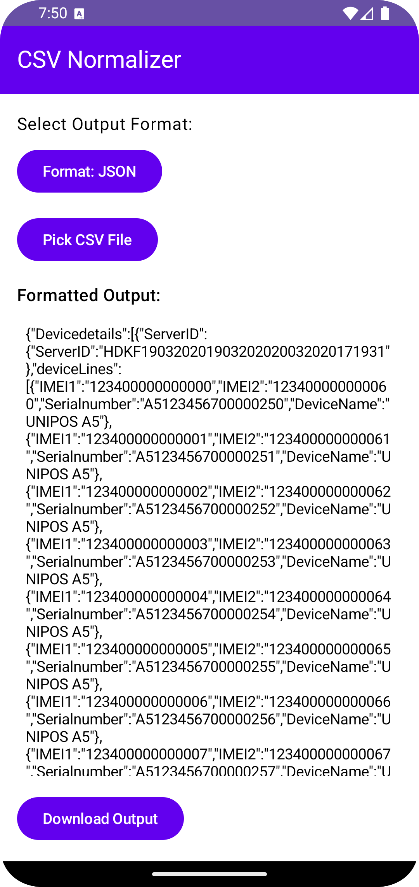
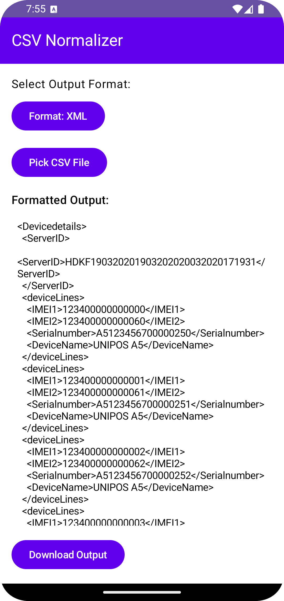

# CSV Normalization Parser - Design Document

## 📘 Overview

The CSV Normalization Parser is a flexible, schema-driven system for parsing, normalizing, and transforming structured CSV-like files into multiple output formats including JSON and XML. It is designed to handle varying report formats without requiring source code changes, supporting line prefixes (record types) like `H`, `R`, `T`, and any custom-defined identifiers.

---

## 🎯 Goals

- Support multiple CSV formats with varied delimiters and line structures.
- Use JSON configuration to drive all parsing and transformation logic.
- Enable extensibility and maintainability through modular architecture.
- Export data in well-formatted JSON, XML, SQL, or YAML outputs.
- Improve maintainability and readability through dependency injection using Hilt.

---

## ⚙️ System Components

### 1. `CsvLineParser`

- Parses each line using delimiter and stores entries in position-indexed manner (e.g., `Map<Int, String>`).
- Delegates structure logic to schema parser.

### 2. `SchemaParserImpl`

- Reads the config JSON schema.
- Identifies line type using first character (e.g., `H`, `R`, `T`).
- For each record type, extracts fields as per defined positions.
- Applies transformation rules.

### 3. `DefaultNormalizer`

- Groups records into containers (e.g., array for `R`, object for `H`).
- Respects nesting, `isArray`, and `itemTag` flags from config.

### 4. `RenderEngineRegistry`

- Outputs final structured data into:
  - JSON (using kotlin serialization )
  - XML (via generic `XmlSerializer`)
  - SQL or YAML (planned extensions)

### 5. UI (Android)

- Scrollable preview box for output.
- Button to download output using FileProvider.
- Dynamic fetching of config file from Supabase Storage.

### 6. Dependency Injection

- All components are injected using Hilt to reduce boilerplate, increase modularity, and support easier testing.

---

## 🔄 Dynamic Record-Type Handling (H, R, T and more)

### ✅ Principle: Schema-Driven, Not Hardcoded

All structural definitions are driven by the configuration schema. For example:

```json
"recordTypes": {
  "H": { "fields": [...] },
  "R": { "container": "entries", "isArray": true, "fields": [...] },
  "T": { "fields": [...] }
}
```

- Each line's first character (`line[0]`) determines the record type.
- Schema provides all details on how to parse and structure it.

#### Benefits:

- Supports any line prefix (e.g., `S`, `X`, `E`, etc.)
- Grouping, transformations, and nesting are fully dynamic.
- Enables multiple file types without modifying core logic.

---

## 📥 Sample JSON Configuration Schema

```json
{
  "$schema": "http://json-schema.org/draft-07/schema#",
  "title": "NormalizationConfig",
  "type": "object",
  "required": ["outputFormat", "recordTypes", "structure"],
  "properties": {
    "outputFormat": {
      "type": "string",
      "enum": ["json", "xml", "sql", "yaml"]
    },
    "root": {
      "type": "object",
      "properties": {
        "element": { "type": "string" },
        "isArray": { "type": "boolean" }
      },
      "required": ["element"]
    },
    "structure": {
      "type": "array",
      "items": { "type": "string" },
      "minItems": 1
    },
    "recordTypes": {
      "type": "object",
      "patternProperties": {
        "^[A-Z]$": {
          "type": "object",
          "required": ["fields"],
          "properties": {
            "type": { "type": "string" },
            "container": { "type": "string" },
            "itemTag": { "type": "string" },
            "isArray": { "type": "boolean" },
            "fields": {
              "type": "array",
              "items": {
                "type": "object",
                "required": ["key", "position"],
                "properties": {
                  "key": { "type": "string" },
                  "position": { "type": "integer", "minimum": 0 },
                  "transform": { "type": "string" }
                }
              }
            }
          }
        }
      }
    },
    "transformations": {
      "type": "object",
      "additionalProperties": {
        "type": "object"
      }
    },
    "outputRules": {
      "type": "object",
      "properties": {
        "json": { "type": "object" },
        "xml": { "type": "object" },
        "sql": { "type": "object" }
      }
    }
  }
}
```

---

## 📊 Sequence Diagram

```plaintext
User Action
    |
    v
Select CSV + Config
    |
    v
CsvLineParser (reads lines)
    |
    v
SchemaParserImpl (parses based on first token)
    |
    v
DefaultNormalizer (groups, transforms, nests)
    |
    v
RenderEngine (formats to JSON/XML)
    |
    v
MainActivity
    ├── Shows output in scroll view
    └── Allows download
```

---

## 🧩 Extensibility

- Add new output formats via RenderEngineRegistry.
- Plug in new transformation rules.
- Store user-specific schema configs remotely.

---

## 🔐 Security

- File downloads handled via FileProvider with proper `provider` authority.
- [Supabase security redacted for brevity.]

---

## 🧪 Testing

- All components are modular and injected, allowing for easier testing.
- Mock CSVs with multiple record types.
- Validate with various delimiter and nesting setups.
- Compare output with expected structured formats.

---

## ✅ Conclusion

This parser allows deep customization of CSV interpretation, driven entirely by a powerful schema system. It's well-suited for processing third-party device reports, financial logs, or integration feeds, where structure varies widely and flexibility is essential.

## 🖼️ App Screenshots
### JSON/XML Screen
 


